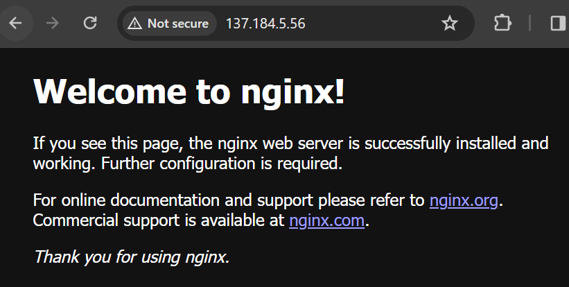

1. Install `vim` and `nginx`
--* `sudo pacman -S vim`
--* `sudo pacman -S nginx`

2. Create a new directory to contain your website documents using `mkdir -p ~/web/html/nginx-2420`
--*`nginx-2420` can be replaced with whatever you want, but since we are naming our server `nginx-2420`, it is best practice to name this directory after the server.

3. Go to the directory we just made: `cd web/html/nginx-2420`

4. Create a new bash file to set up our server: `vim nginx-2420.service`

5. Set up a server block:
--*Click your `Insert` key to begin typing in the bash script.
--*Be sure to edit `yourhtml.html` to the html that you will use as your server homepage
```bash
server {
    listen 80;
    listen [::]:80;
    server_name nginx-2420;
    root /web/html/nginx-2420;
    location / {
        index yourhtml.html;
    }
}
```
--*Click your `Esc` key when you are done entering the above code
--*Click `Shift+Z+Z` to save and exit your bash script

6. Give your bash script execute permissions: `sudo chmod +x nginx-2420.service`
--*This will allow for your script to run

7. Run your script: `bash nginx-2402.service`
--*To check if your server is `active`, use the following: `systemctl status nginx`
--* You should see `Active: active (running)` in green, this means your server is succesfully running.

8. To visit your server, enter you IP into your browser.

